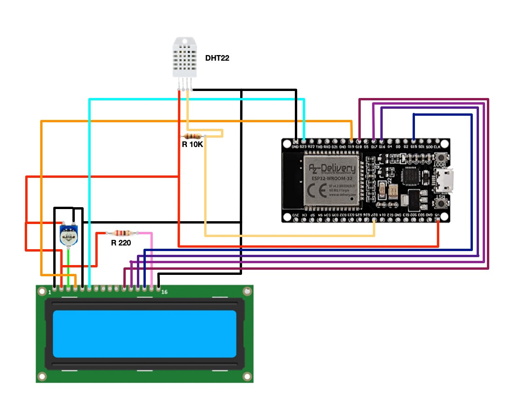

# Weather Station ESP32

Simple PlatformIO project to create a weather station with ESP32, DHT sensor, LCD 16x2.
Connects over Wi-Fi and with simple web server for querying temperature and humidity data.

## Parts used

- ESP32 DEV Kit Board (AZDelivery ESP-WROOM-32)
- DHT22 (AM2302) Temperature and Humidity Sensor
- LCD 16x2 (LCM1602C)
- 10K&#x2126; Potentiometer to adjust LCD contrast
- 220&#x2126; Resistor
- 10K&#x2126; Resistor

## Schematic

## Build

Recommend using VSCode with PlatformIO extension

Copy file settings.conf.example to settings.conf and modify to reflect your settings

